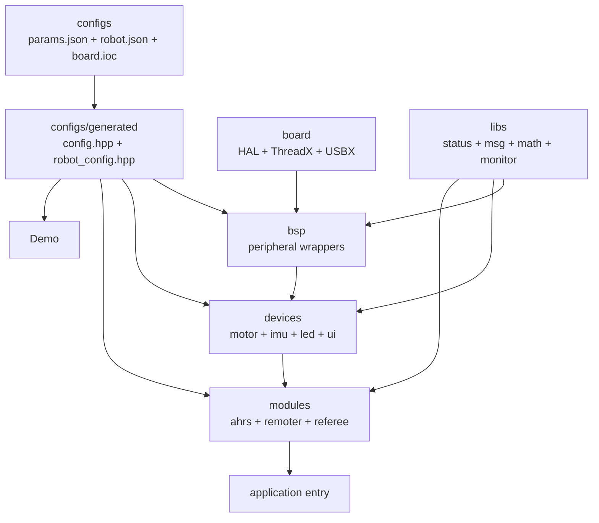

# pnx embedded template

工程以 STM32CubeMX 生成的 HAL/ThreadX/USBX 工程为硬件基础，在其上提供配置驱动的 BSP、设备抽象、可复用业务模块、通用库和板端 demo。

当前工程目标不是把所有能力封装成厚重平台，而是让硬件绑定、设备实例和服务线程尽量由配置描述，由 CMake 在配置阶段生成只读头文件；业务代码只依赖稳定接口和生成出的绑定常量。

## 目录结构

| 目录 | 职责 |
| --- | --- |
| `board/` | STM32CubeMX/HAL/ThreadX/USBX 生成工程、启动文件、链接脚本和工具链文件。 |
| `configs/` | `params.json`、`robot.json`、IOC 解析与 `config.hpp`/`robot_config.hpp` 生成逻辑。 |
| `demo/` | 板端联调入口、具体 demo 和主机侧验证脚本。 |
| `cmsis-dsp/` | 随工程纳入的 CMSIS-DSP 子集，供 AHRS/EKF 等算法使用。 |
| `pnx_bsp/` | CAN、USART、SPI、PWM、DWT、EXTI、Flash、USB 等板级外设封装。 |
| `pnx_devices/` | 电机、IMU、LED、UI 等基于 BSP 的具体设备与统一接口。 |
| `pnx_modules/` | AHRS、遥控器、裁判系统等可持续运行的服务线程。 |
| `pnx_libs/` | 状态码、消息、CRC、控制、滤波、数学和运行时监控等通用能力。 |

## 分层关系



依赖方向保持单向：上层不直接操作 HAL 句柄，硬件资源通过 `bsp` 暴露；设备层统一相似硬件能力；模块层负责服务线程和消息发布；后续再接入用户接口。

## 构建

构建配置阶段会读取：

- `board/board.ioc`
- `configs/params.json`
- `configs/robot.json`
- `configs/cmake/generate_config.cmake`

并生成：

- `configs/generated/config.hpp`
- `configs/generated/robot_config.hpp`

生成文件由 CMake 管理，业务修改应回到 JSON 或 IOC，而不是手改 generated 目录。

## 入口

ThreadX 初始化阶段会从 `board/Core/Src/app_threadx.c` 调用：

```cpp
extern "C" void app_start();
```

当前实现位于 `demo/app.cpp`，通过打开对应 `demo::<name>::run()` 或 `demo::<name>::start()` 选择板端联调入口。后续正式机器人应用也应从这里完成服务初始化和设备装配。

## 开发约束

- 优先扩展现有层次：配置放 `configs`，外设封装放 `bsp`，硬件对象放 `devices`，持续运行的通用服务放 `modules`，纯工具能力放 `libs`。
- 新增抽象必须承担真实职责，例如协议隔离、类型安全、并发边界或复用；不要新增只转发一次的薄封装。
- BSP 公共接口优先返回 `types::status`，并避免把 HAL 状态、句柄和中断细节泄漏给上层。
- 通信接收优先使用注册回调、信号量或 `msg` topic，不在模块内部私有化输出通道。
- 板端调试优先暴露 telemetry/debug state，demo 中避免依赖 `printf`。
- 修改 `params.json`、`robot.json` 或 `board.ioc` 后重新 configure/build，确保生成头文件同步。
